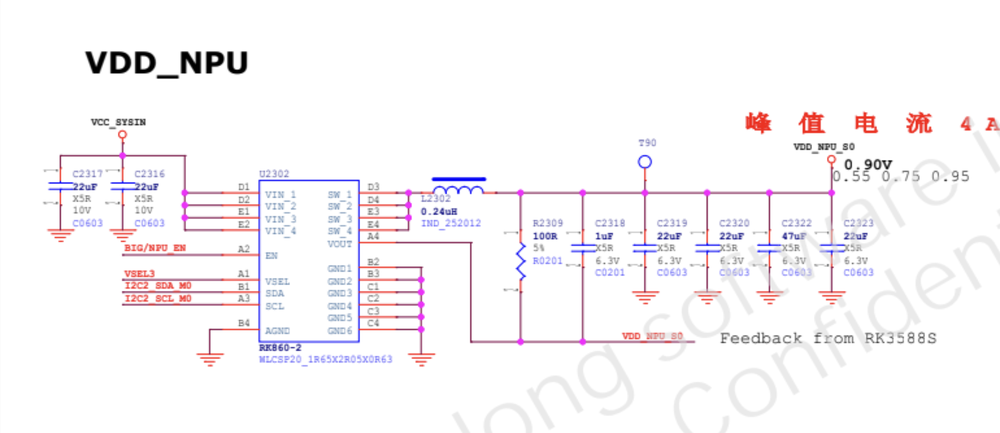

# rk3588

<!-- **Goal:** Rockchip RK3588 RKNN NPU backend passing all ops tests in [tinygrad](https://github.com/tinygrad/tinygrad) -->

## NPU
- Neural network acceleration engine with processing performance up to 6 TOPS 
The built-in NPU supports INT4/INT8/INT16/FP16 hybrid operation and computing power is
up to 6TOPs
- You can run all three in lock-step on one big model (triple-core co-work), split a workload across any two (dual-core), or run each NPU on a totally independent task
    - The chip actually embeds three identical NPU “tiles.”
- Supports int4, int8, int16, float16, bfloat16 and tf32 operation
- Embedded 384KBx3 internal buffer
    - Each of the three NPU cores has its own 384 kilobytes of ultra-fast SRAM scratchpad.
    - On-chip buffers let the NPU keep weights, activations, or intermediate results very close to the compute units, minimizing costly off-chip memory traffic.
- One isolated voltage domain to support DVFS
- The IP is closely based on NVDLA.
- RKNPU2 NPU software stack
- Supported Ops
    - Conv layers, linear layers, elementwise ops, pooling ops

## Documents

- [Brief Datasheet](https://www.rock-chips.com/uploads/pdf/2022.8.26/192/RK3588%20Brief%20Datasheet.pdf)
- [Datasheet](https://www.boardcon.com/download/Rockchip_RK3588_Datasheet_V1.0-20211220.pdf)
- [Technical Reference Manual (TRM)](https://www.scs.stanford.edu/~zyedidia/docs/rockchip/rk3588_part1.pdf)
- [Reverse Engineering](https://github.com/mtx512/rk3588-npu/tree/main)
- [Reverse Engineering 2](https://jas-hacks.blogspot.com/2024/02/rk3588-reverse-engineering-rknn.html)
- [Notes](https://gitlab.collabora.com/hardware-enablement/rockchip-3588/notes-for-rockchip-3588)
- [NPU Driver](https://gitlab.freedesktop.org/mesa/mesa/-/merge_requests/29698)
- [rknn-llm](https://github.com/airockchip/rknn-llm)
- [r/RockchipNPU](https://www.reddit.com/r/RockchipNPU/wiki/index/)
- [Rockchip_User_Guide_RKNN_Toolkit_Visualization_V1.7.5_EN.pdf](https://github.com/airockchip/rknn-toolkit/blob/master/doc/Rockchip_User_Guide_RKNN_Toolkit_Visualization_V1.7.5_EN.pdf)
- [ggml NPU discussion](https://github.com/ggml-org/llama.cpp/issues/722)
- [Rockchip kernel driver](https://github.com/armbian/linux-rockchip)
- [Using NPU with RKNN](https://wiki.t-firefly.com/en/ROC-RK3588S-PC/usage_npu.html)

## Twitter

- [thread](https://x.com/b0jle/status/1918290647502762343)
    - The hardware is pretty well documented in the RK3588 datasheet.
    - Rockchip RK3588 RKNN NPU backend passing all ops tests
    - Registers are set by issueing ioctls's and involvement of the rknpu drivers.

## TODO
- make a backup of opi-5 firmware and OS image to prevent bricking